# ProConnect UML Diagrams

## How to View
- **GitHub**: Renders automatically
- **VS Code**: Install "Markdown Preview Mermaid Support"
- **Online**: https://mermaid.live/

---

## 1. USE CASE DIAGRAM

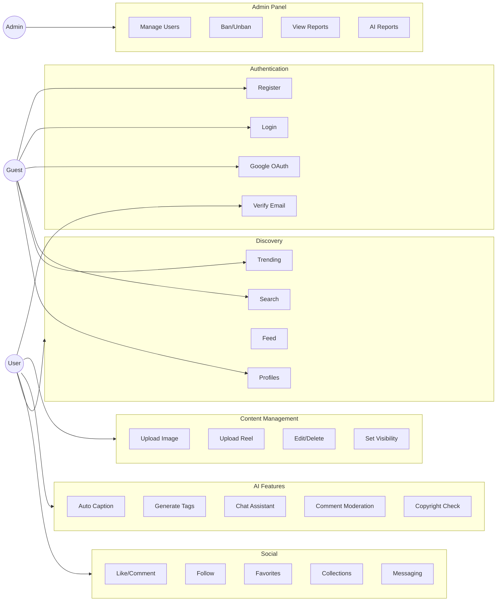

---

## 2. CLASS DIAGRAM

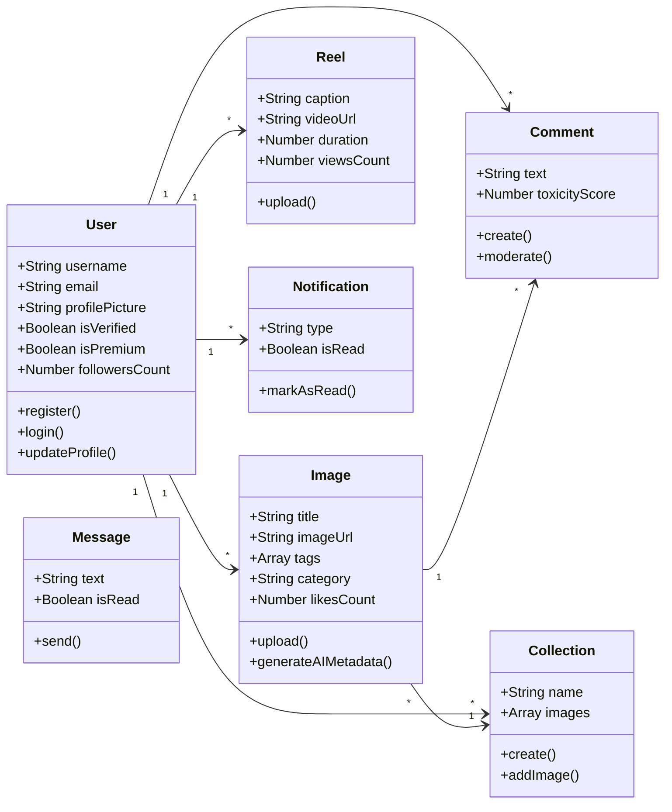

---

## 3. ACTIVITY DIAGRAM - Image Upload

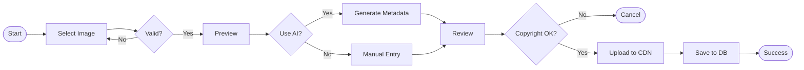

---

## 4. ACTIVITY DIAGRAM - AI Feed Ranking

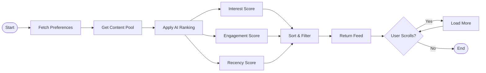

---

## 5. SEQUENCE DIAGRAM - User Login

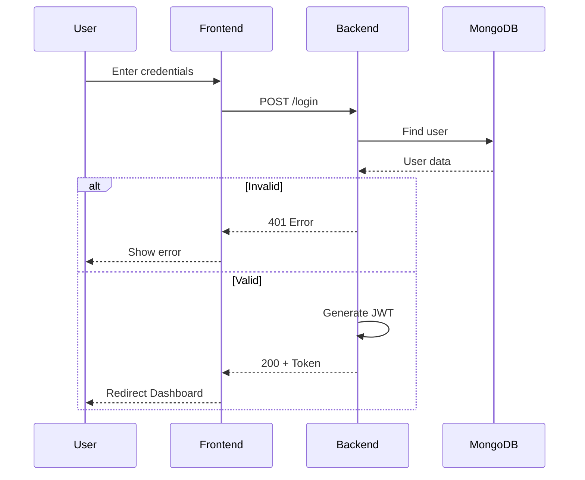

---

## 6. SEQUENCE DIAGRAM - AI Image Analysis

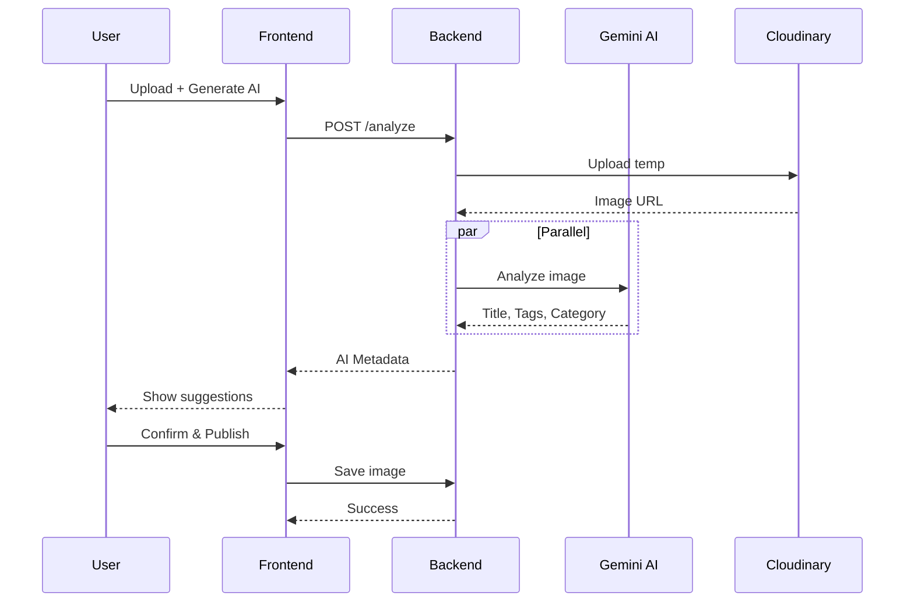

---

## 7. SEQUENCE DIAGRAM - AI Chat

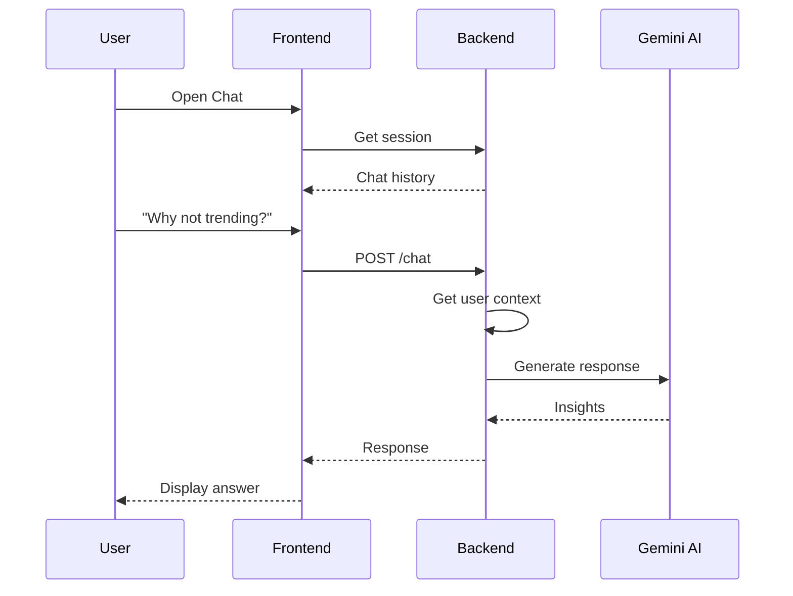

---

## 8. SEQUENCE DIAGRAM - Comment Moderation

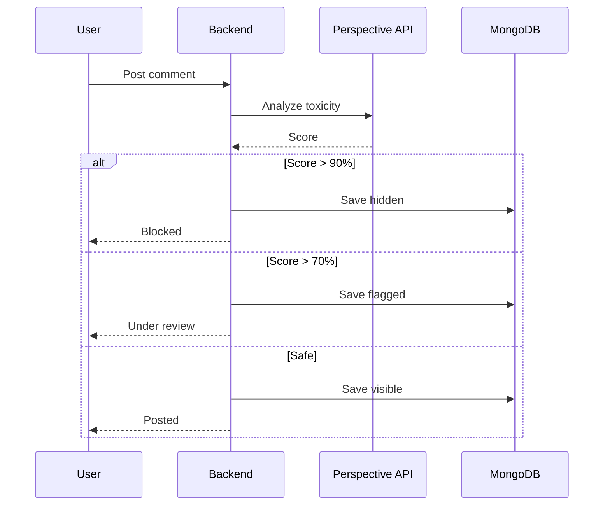

---

## 9. STATE DIAGRAM - User Account

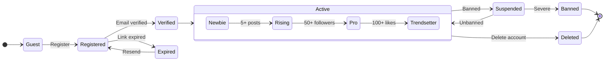

---

## 10. STATE DIAGRAM - Image Lifecycle

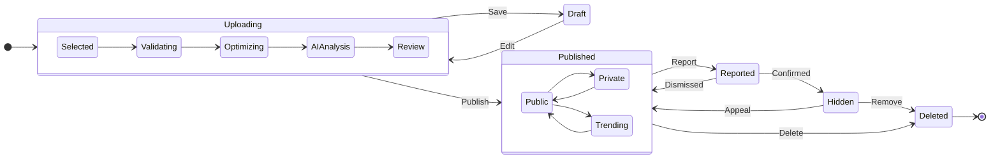

---

## 11. STATE DIAGRAM - AI Growth Agent

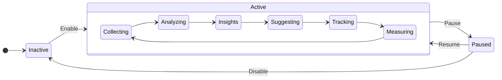

---

## 12. COMPONENT DIAGRAM

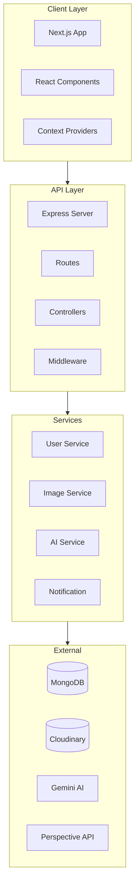

---

## 13. DEPLOYMENT DIAGRAM

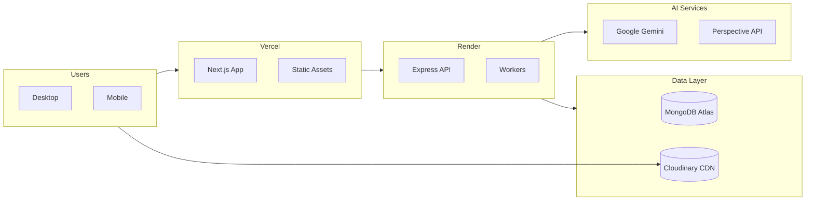

---

## 14. DATA FLOW DIAGRAM - Level 0

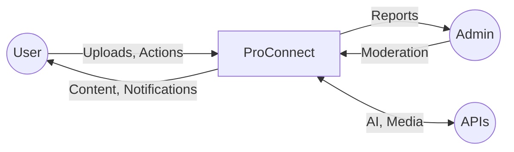

---

## 15. DATA FLOW DIAGRAM - Level 1

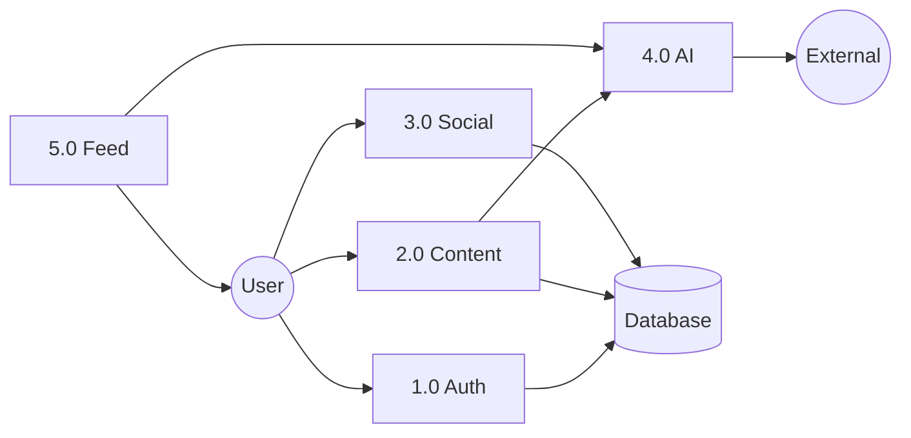

---

## 16. ER DIAGRAM

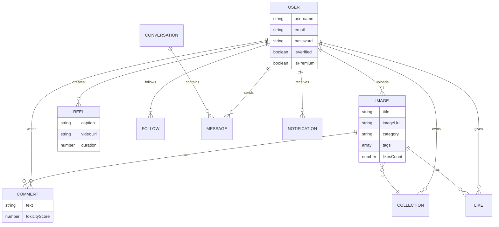

---

## Features Covered

| Category | Features |
|----------|----------|
| **Auth** | Email, Google OAuth, Email Verification |
| **Content** | Image Upload, Reels, Collections, Visibility |
| **AI** | Captioning, Tags, Chat, Moderation, Copyright |
| **Social** | Like, Comment, Follow, Favorites, Messaging |
| **Discovery** | Search, Trending, Feed, Profiles |
| **Analytics** | Dashboard, Stats, Growth Agent |
| **Admin** | User Management, Reports, Moderation |
