# ProConnect UML Diagrams

## How to View These Diagrams

1. **GitHub**: Mermaid renders automatically in GitHub markdown
2. **VS Code**: Install "Markdown Preview Mermaid Support" extension
3. **Online**: Go to https://mermaid.live/ and paste the code
4. **Draw.io**: Import Mermaid diagrams directly

---

## 1. USE CASE DIAGRAM

```mermaid
flowchart LR
    subgraph Actors
        Guest((Guest))
        User((Registered User))
        Premium((Premium User))
        Creator((Content Creator))
        Admin((Administrator))
    end

    subgraph "ProConnect System"
        subgraph "Authentication & Security"
            UC1[Register with Email]
            UC2[Login with Email]
            UC3[Login with Google OAuth]
            UC4[Verify Email]
            UC5[Reset Password]
            UC6[Two-Factor Authentication]
            UC7[Logout]
        end

        subgraph "Image Management"
            UC10[Upload Image - Drag & Drop]
            UC11[View Image]
            UC12[Edit Image Details]
            UC13[Delete Image]
            UC14[Download Image]
            UC15[Image Optimization]
            UC16[Set Image Visibility]
        end

        subgraph "Reels Management"
            UC20[Upload Reel]
            UC21[View Reels Feed]
            UC22[Like Reel]
            UC23[Comment on Reel]
            UC24[Save Reel]
            UC25[Share Reel]
        end

        subgraph "AI-Powered Features"
            UC30[AI Auto-Generate Caption]
            UC31[AI Generate Tags]
            UC32[AI Detect Category]
            UC33[AI Generate Alt Text]
            UC34[AI Semantic Search]
            UC35[AI Comment Moderation]
            UC36[AI Copyright Detection]
            UC37[AI Chat Assistant]
            UC38[AI Creator Growth Agent]
            UC39[AI Smart Feed Ranking]
            UC40[AI Report Generation]
        end

        subgraph "Social Interactions"
            UC50[Like Image]
            UC51[Comment on Image]
            UC52[Reply to Comment]
            UC53[Follow User]
            UC54[Unfollow User]
            UC55[Add to Favorites]
            UC56[Share to Social Media]
        end

        subgraph "Collections"
            UC60[Create Collection]
            UC61[Add Image to Collection]
            UC62[View Collections]
            UC63[Delete Collection]
        end

        subgraph "Messaging & Notifications"
            UC70[Send Direct Message]
            UC71[View Conversations]
            UC72[View Notifications]
            UC73[Real-time Updates]
        end

        subgraph "Discovery & Search"
            UC80[Smart Search Images]
            UC81[Filter by Category]
            UC82[Filter by Tags]
            UC83[Browse Trending]
            UC84[View User Profile]
            UC85[Infinite Scroll Feed]
            UC86[Masonry Layout View]
        end

        subgraph "User Experience"
            UC90[Toggle Dark/Light Theme]
            UC91[Responsive Layout]
            UC92[Keyboard Shortcuts]
            UC93[Edit Profile]
        end

        subgraph "Analytics & Insights"
            UC100[View User Dashboard]
            UC101[View Image Analytics]
            UC102[View Engagement Stats]
            UC103[View Follower Growth]
            UC104[Get AI Growth Suggestions]
        end

        subgraph "Administration"
            UC110[View Admin Dashboard]
            UC111[Manage All Users]
            UC112[Ban/Unban User]
            UC113[View User Reports]
            UC114[Review Flagged Content]
            UC115[Generate AI Platform Report]
            UC116[Content Moderation Queue]
        end

        subgraph "Reporting & Safety"
            UC120[Report User]
            UC121[Report Image]
            UC122[Appeal Ban]
        end
    end

    Guest --> UC1
    Guest --> UC2
    Guest --> UC3
    Guest --> UC11
    Guest --> UC83
    Guest --> UC84

    User --> UC4
    User --> UC5
    User --> UC7
    User --> UC10
    User --> UC11
    User --> UC12
    User --> UC13
    User --> UC20
    User --> UC21
    User --> UC22
    User --> UC30
    User --> UC37
    User --> UC50
    User --> UC51
    User --> UC53
    User --> UC55
    User --> UC60
    User --> UC70
    User --> UC72
    User --> UC80
    User --> UC90
    User --> UC93
    User --> UC100
    User --> UC120

    Creator --> UC38
    Creator --> UC104

    Premium --> UC36
    Premium --> UC6

    Admin --> UC110
    Admin --> UC111
    Admin --> UC112
    Admin --> UC113
    Admin --> UC114
    Admin --> UC115
    Admin --> UC40
```

---

## 2. CLASS DIAGRAM

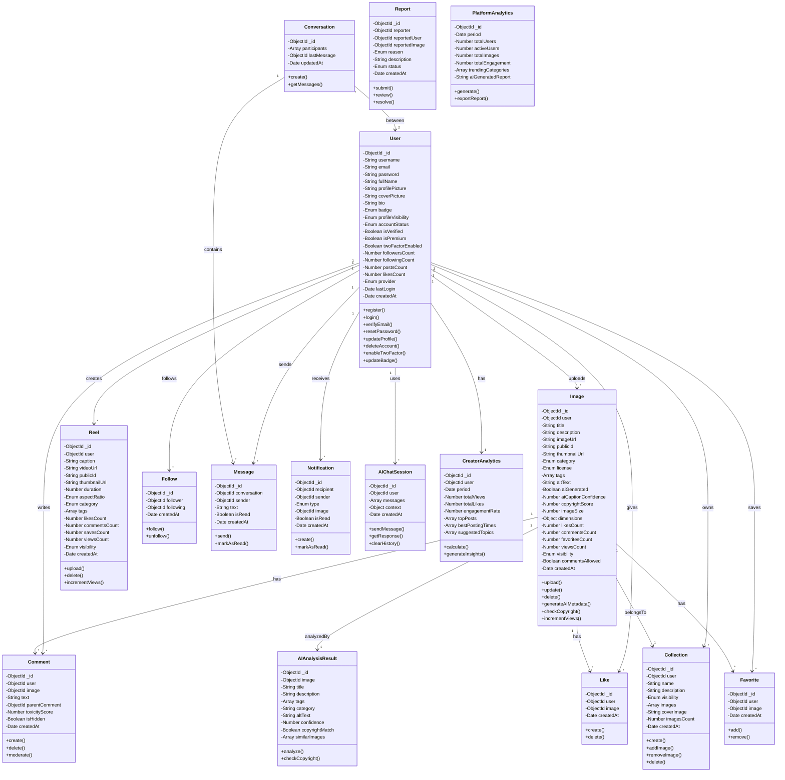

---

## 3. ACTIVITY DIAGRAM - Image Upload with AI Features

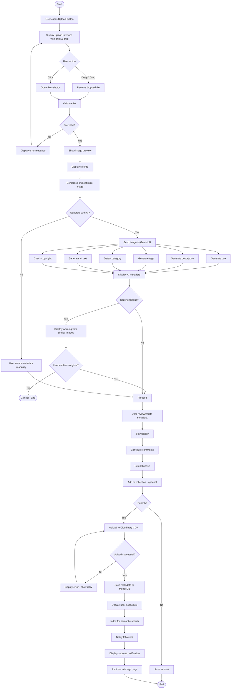

---

## 4. ACTIVITY DIAGRAM - AI Smart Feed Ranking

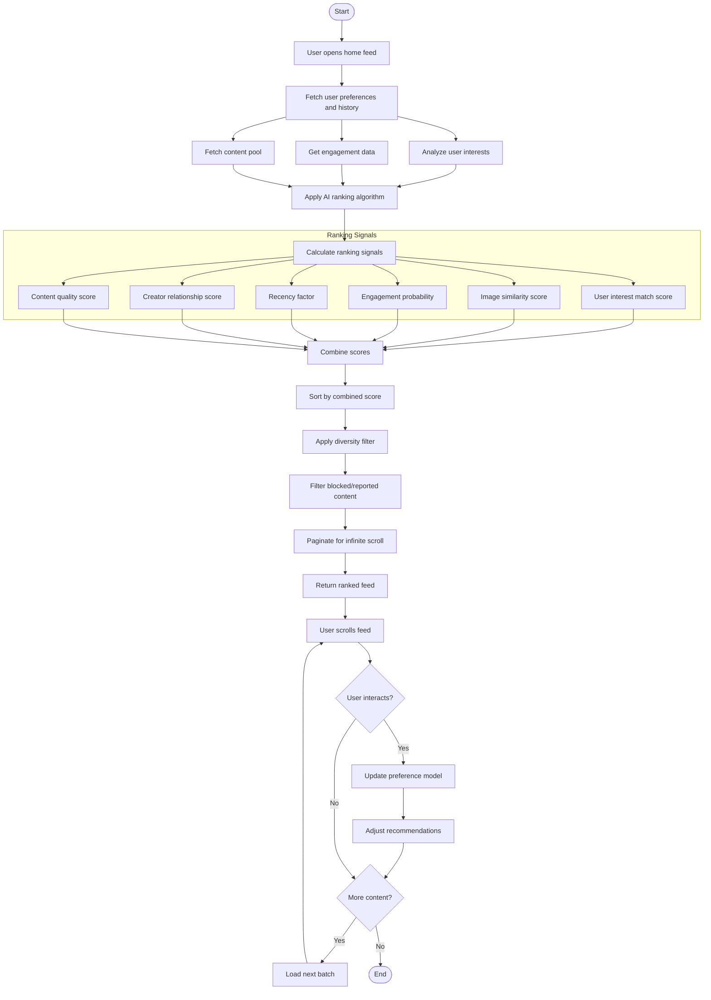

---

## 5. SEQUENCE DIAGRAM - User Authentication

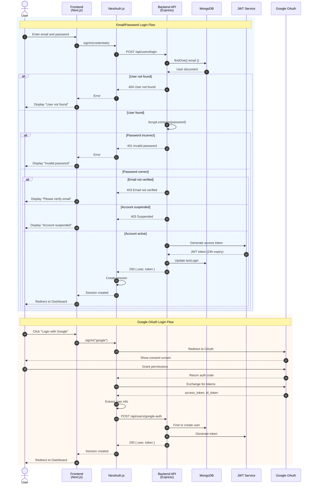

---

## 6. SEQUENCE DIAGRAM - AI Image Analysis & Copyright Check

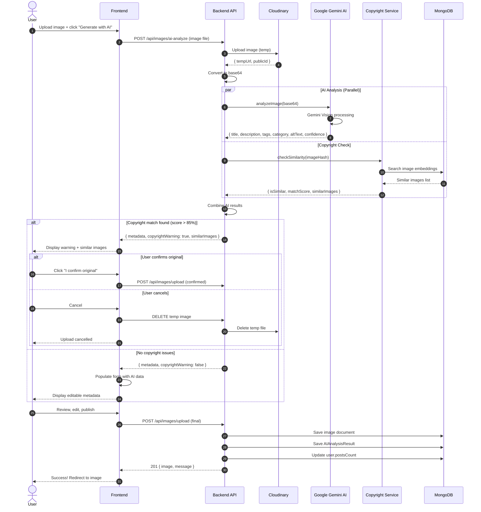

---

## 7. SEQUENCE DIAGRAM - AI Chat Assistant

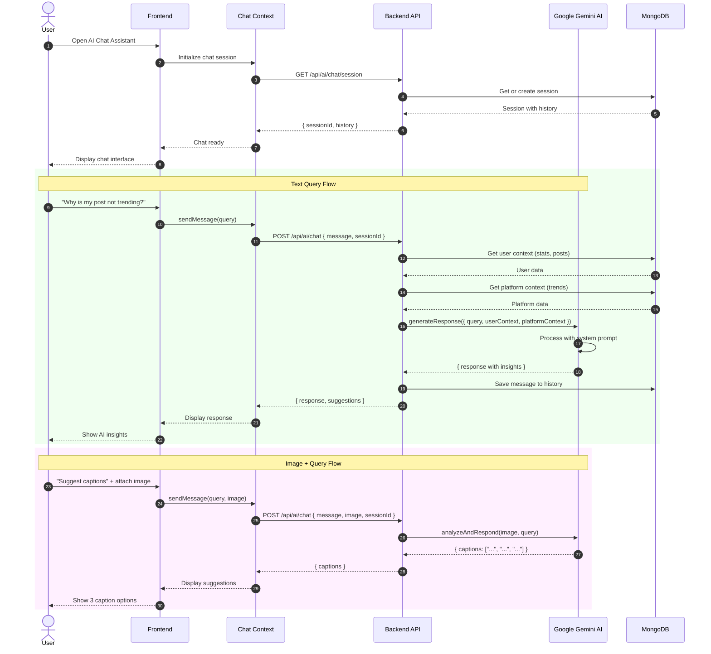

---

## 8. SEQUENCE DIAGRAM - AI Comment Moderation

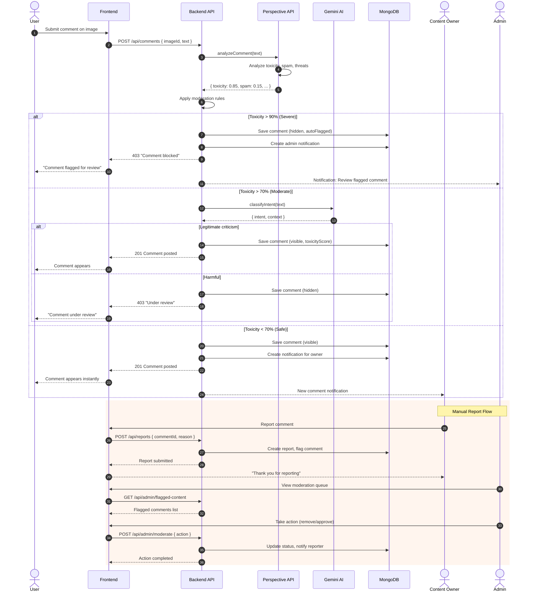

---

## 9. STATE DIAGRAM - User Account States

```mermaid
stateDiagram-v2
    [*] --> Unregistered

    state Unregistered {
        [*] --> Guest
        Guest: Can view public content
        Guest: Can browse and search
        Guest: Cannot interact or upload
    }

    Unregistered --> Registering: Click Register

    state Registering {
        [*] --> FormFilling
        FormFilling: Enter username, email, password
        FormFilling --> Validating: Submit
        Validating: Check uniqueness, strength
        Validating --> FormFilling: Failed
        Validating --> AccountCreated: Passed
        AccountCreated: Saved to DB, email sent
    }

    Registering --> PendingVerification: Account created

    state PendingVerification {
        PendingVerification: Email not verified
        PendingVerification: Limited features
    }

    PendingVerification --> Active: Verify email
    PendingVerification --> Expired: Link expires (24h)
    Expired --> PendingVerification: Request new link

    state Active {
        [*] --> Newbie
        
        state BadgeProgression {
            Newbie: Posts 0-4
            Newbie --> Rising: Posts > 4
            Rising: Followers < 50
            Rising --> Pro: Followers >= 50
            Pro: Likes < 100
            Pro --> Trendsetter: Likes >= 100
            Trendsetter: Featured placement
        }
        
        state AccountType {
            StandardUser: Basic features
            StandardUser --> PremiumUser: Subscribe
            PremiumUser: Unlimited uploads
            PremiumUser: AI copyright
            PremiumUser: Priority support
            PremiumUser --> StandardUser: Expires
        }
        
        state TwoFactorAuth {
            TwoFADisabled: Standard login
            TwoFADisabled --> TwoFAEnabled: Enable
            TwoFAEnabled: TOTP required
            TwoFAEnabled --> TwoFADisabled: Disable
        }
    }

    Active --> Suspended: Admin bans / Violation
    Active --> SelfDeactivated: User deactivates
    Active --> Deleted: Request deletion

    state Suspended {
        Suspended: Cannot login
        Suspended: Content hidden
    }

    Suspended --> UnderAppeal: User appeals
    UnderAppeal --> Active: Appeal approved
    UnderAppeal --> Suspended: Appeal denied
    UnderAppeal --> PermanentlyBanned: Severe violation

    state SelfDeactivated {
        SelfDeactivated: Account hidden
        SelfDeactivated: Data preserved
    }

    SelfDeactivated --> Active: Reactivate (login)
    SelfDeactivated --> Deleted: No activity 1 year

    state PermanentlyBanned {
        PermanentlyBanned: Cannot appeal
    }

    state Deleted {
        Deleted: Account removed
        Deleted: Data anonymized
    }

    PermanentlyBanned --> [*]
    Deleted --> [*]
```

---

## 10. STATE DIAGRAM - Image Lifecycle

```mermaid
stateDiagram-v2
    [*] --> Uploading

    state Uploading {
        [*] --> FileSelected
        FileSelected: Image chosen
        FileSelected --> Validating: Submit
        
        Validating: Check type, size, dimensions
        Validating --> FileSelected: Invalid
        Validating --> Optimizing: Valid
        
        Optimizing: Compress, thumbnail, responsive
        Optimizing --> AIProcessing: Complete
        
        AIProcessing: AI analyzing
        AIProcessing --> CopyrightCheck: Generate metadata
        AIProcessing --> MetadataReview: Skip AI
        
        CopyrightCheck: Check similarity
        CopyrightCheck --> CopyrightWarning: Match found
        CopyrightCheck --> MetadataReview: No match
        
        CopyrightWarning: Display warning
        CopyrightWarning --> MetadataReview: Confirm original
        CopyrightWarning --> Cancelled: Cancel
        
        MetadataReview: Edit, visibility, comments
        MetadataReview --> CloudUpload: Publish
        
        CloudUpload: Upload to Cloudinary
        CloudUpload --> Failed: Error
        CloudUpload --> Published: Success
    }

    Uploading --> Draft: Save draft
    Draft --> Uploading: Resume
    Draft --> Deleted: Delete draft

    state Published {
        [*] --> Public
        
        Public: Visible to all, searchable
        Private: Owner only, direct link
        FollowersOnly: Followers see
        
        Public --> Private: Change
        Public --> FollowersOnly: Change
        Private --> Public: Change
        Private --> FollowersOnly: Change
        FollowersOnly --> Public: Change
        FollowersOnly --> Private: Change
        
        state Interactions {
            Normal: Standard display
            Normal --> Trending: High engagement
            Trending: Featured, boosted
            Trending --> Normal: Drops
            Normal --> Featured: Admin features
            Featured --> Normal: Period ends
        }
    }

    Published --> Reported: User reports

    state Reported {
        PendingReview: Under investigation
        PendingReview --> Reviewed: Admin reviews
    }

    Reported --> Published: Dismissed
    Reported --> Hidden: Confirmed

    state Hidden {
        Hidden: Removed from feed/search
        Hidden: Policy violation notice
    }

    Hidden --> Published: Appeal success
    Hidden --> Deleted: Admin removes

    Published --> Editing: Owner edits
    Editing --> Published: Save

    Published --> Deleted: Owner deletes

    state Deleted {
        Deleted: Cloudinary cleanup
        Deleted: Removed from collections
    }

    state Failed {
        Failed: Upload error
    }

    Failed --> Uploading: Retry
    Failed --> [*]: Cancel
    Cancelled --> [*]
    Deleted --> [*]
```

---

## 11. STATE DIAGRAM - AI Creator Growth Agent

```mermaid
stateDiagram-v2
    [*] --> Inactive

    state Inactive {
        Inactive: Not using growth features
        Inactive: Dashboard available
    }

    Inactive --> Monitoring: Enable growth agent

    state Monitoring {
        [*] --> CollectingData
        
        CollectingData: Gathering metrics
        CollectingData: Analyzing patterns
        CollectingData: Tracking growth
        CollectingData --> Analyzing: 7 days data
        
        Analyzing: AI processing
        Analyzing: Comparing to successful creators
        Analyzing --> GeneratingInsights: Complete
        
        GeneratingInsights: Creating recommendations
        GeneratingInsights --> Ready: Done
        
        state Ready {
            [*] --> DisplayingInsights
            
            DisplayingInsights: Best posting times
            DisplayingInsights: Trending topics
            DisplayingInsights: Hashtag suggestions
            
            DisplayingInsights --> SuggestingAction: View
            SuggestingAction: Specific recommendation
            SuggestingAction --> TrackingAction: Act
            SuggestingAction --> DisplayingInsights: Dismiss
            
            TrackingAction: Monitor outcome
            TrackingAction --> MeasuringImpact: 48h
            
            MeasuringImpact: Compare before/after
            MeasuringImpact --> UpdatingModel: Calculated
            
            UpdatingModel: Refine recommendations
            UpdatingModel --> DisplayingInsights: Updated
        }
    }

    Monitoring --> Paused: Pause

    state Paused {
        Paused: Agent inactive
        Paused: Data preserved
    }

    Paused --> Monitoring: Resume
    Paused --> Inactive: Disable

    state WeeklyReport {
        ScheduledReport: Sunday 9 AM
        ScheduledReport --> CompilingStats: Trigger
        CompilingStats --> GeneratingReport: Done
        GeneratingReport: AI writing summary
        GeneratingReport --> SendingReport: Ready
        SendingReport: Email + in-app
    }

    Monitoring --> WeeklyReport: Weekly trigger
    WeeklyReport --> Monitoring: Delivered
```

---

## 12. COMPONENT DIAGRAM

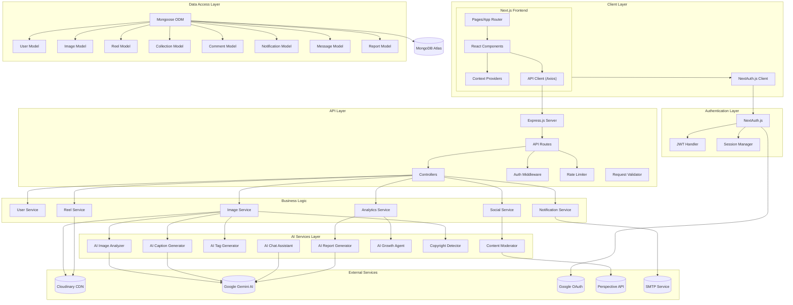

---

## 13. DEPLOYMENT DIAGRAM

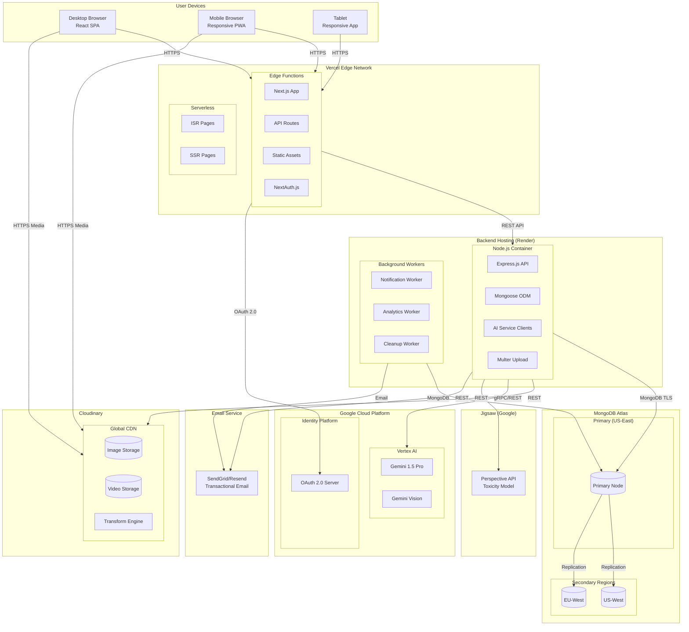

---

## 14. DATA FLOW DIAGRAM - Level 0 (Context)

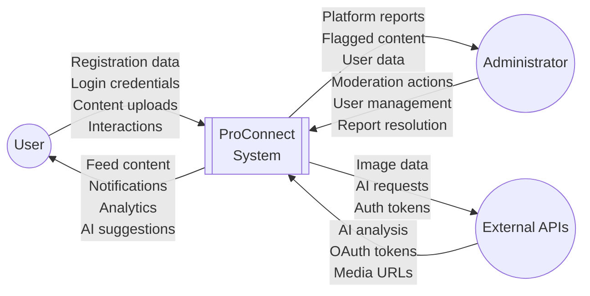

---

## 15. DATA FLOW DIAGRAM - Level 1

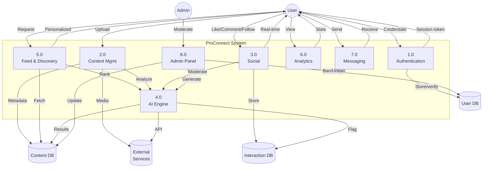

---

## 16. ENTITY RELATIONSHIP DIAGRAM

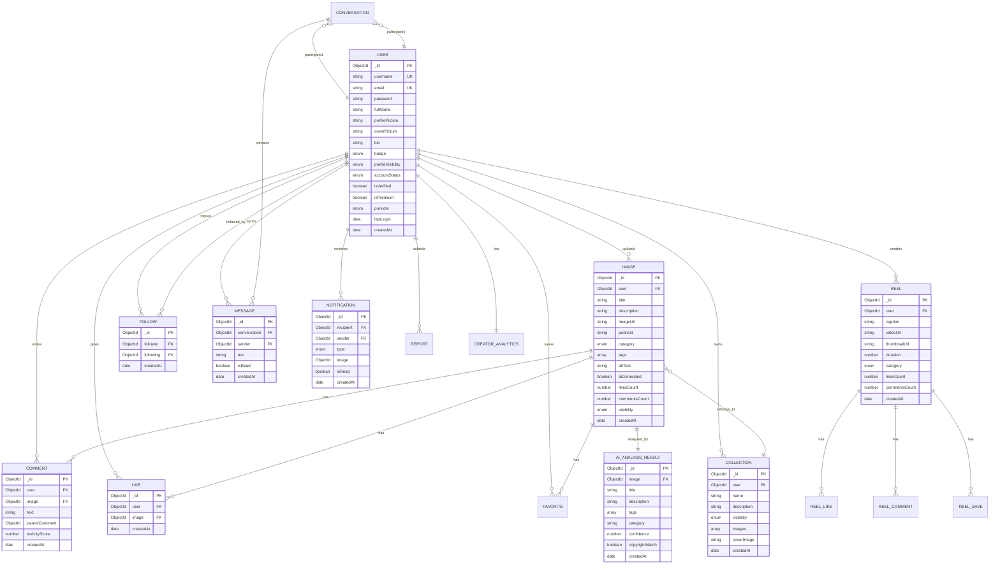

---

## Quick Reference: How to View Diagrams

### Option 1: GitHub (Recommended)
- Push this file to GitHub - diagrams render automatically

### Option 2: VS Code
1. Install "Markdown Preview Mermaid Support" extension
2. Open preview (Ctrl+Shift+V)

### Option 3: Mermaid Live Editor
1. Go to https://mermaid.live/
2. Paste code between ```mermaid and ```
3. Export as PNG/SVG

### Option 4: Draw.io
1. Go to https://app.diagrams.net/
2. Arrange → Insert → Advanced → Mermaid

---

## Diagrams Summary

| # | Diagram Type | Description |
|---|--------------|-------------|
| 1 | Use Case | Complete system use cases with 5 actors |
| 2 | Class | 15 entity classes with relationships |
| 3 | Activity (Upload) | Full upload with AI & copyright check |
| 4 | Activity (Feed) | AI smart feed ranking algorithm |
| 5 | Sequence (Auth) | Email + Google OAuth login flows |
| 6 | Sequence (AI) | Image analysis + copyright detection |
| 7 | Sequence (Chat) | AI assistant conversation flow |
| 8 | Sequence (Moderation) | Comment moderation with Perspective API |
| 9 | State (User) | User account lifecycle with badges |
| 10 | State (Image) | Image upload to deletion lifecycle |
| 11 | State (Growth) | AI creator growth agent states |
| 12 | Component | System architecture layers |
| 13 | Deployment | Infrastructure deployment |
| 14 | DFD Level 0 | Context diagram |
| 15 | DFD Level 1 | Subsystem data flows |
| 16 | ER Diagram | Database entity relationships |

---

## Feature Coverage

### Implemented ✅
- Multi-provider auth (Email + Google)
- Email verification
- Image upload (drag & drop)
- Image optimization
- Dark/Light theme
- Responsive design
- Masonry layout
- Infinite scroll
- Smart search
- Collections
- Like/Comment/Follow
- Favorites
- Notifications
- Direct messaging
- User dashboard
- Admin panel
- AI captioning & tags
- AI chat assistant
- AI comment moderation
- AI admin reports
- Reels

### Planned 🚀
- Two-factor auth
- AI semantic search
- AI copyright detection
- AI creator growth agent
- AI smart feed ranking
- Keyboard shortcuts
- Social sharing
- Premium subscriptions
